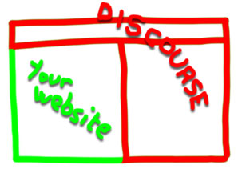

# Docuss

Docuss allows to integrate your website (or web app) with your Discourse forum.

Benefits :

- Smoother user experience
- Website/forum interactions: discuss a page, discuss parts of a page, etc.

## Main Showcase

> <a href="http://www.docuss.org">
> 
> </a>
>
> [Mustacchio](http://www.docuss.org) is a fake website demonstrating most
> Docuss features.

## Other demos

> <a href="http://www.docuss.org/docuss/d_home">
> 
> </a>
>
> [Discuss The Web](http://www.docuss.org/docuss/d_home) is a sample
> Meteor+React web app. See the repo
> [here](https://github.com/sylque/discuss-the-web).

## Project Status

Docuss is in prototype phase. Please report ideas and issues in the above
`Issues` tab.

## Architecture

Docuss is composed of a
[Discourse plugin](https://github.com/sylque/dcs-discourse-plugin2) you add to
your Discourse instance and
[client libraries](https://github.com/sylque/dcs-client) you add to your web
pages.

## License

Docuss components are released under the
[Fair Source 30 license](https://github.com/sylque/docuss/blob/master/LICENSE)
(additional information [here](https://fair.io/)).

Notice that dcs-discourse-plugin2 is released with minified source code only.
This may or may not change in the future.
